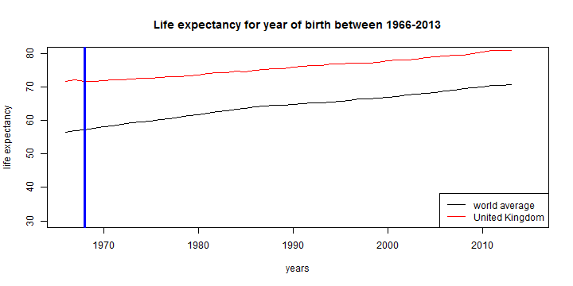

<style>
.title-slide {
  background-color: #000000
}

.title-slide hgroup > h1{
 font-family: 'David', 'Ariel', sanserif; 
}

.title-slide hgroup > h1, 
.title-slide hgroup > h2 {
  color:   #EF5150
}

.slide {
        background-color: #000000
}
</style>
My world life expectancy calculator can be found [here](https://renrele.shinyapps.io/devdatprod). 

Life expectancy at birth indicates the number of years a newborn infant would live if prevailing patterns of mortality at the time of its birth were to stay the same throughout its life.  


The data is from the website of the [World Bank](http://databank.worldbank.org/data/home.aspx).  

---

Life expectancies are available for year of birth between 1966 and 2013, for 214 different countries.  
  
  
Select your year of birth. (- Sorry, if you were born before 1966, this will not be applicable. )    
  
  
Select your country.  
  
  
The app. will display the life expectancy for your year of birth and country combination.  
  
  
For example, selecting year of birth 1968 and the United Kingdom will display:  


```
## [1] 71.72439
```

---

The app will also display the mean world life expectancy for your year of birth, calculated over all countries with available data.

For example, the mean world life expectancy for year of birth 1968 is:

```
## [1] 57.28625
```

---
The greatest feature of the app is the graph showing the trend in life expectancy for years of birth in the range 1966 - 2013. The red line shows the trend for your country, and the black line shows the trend for the world average. The blue bar highlights the points on the two lines for your year of birth and will move to the appropriate location if you select a different year of birth. Selecting a different country will produce a graph showing the trends for the country selected and the world average.

Graph showing trends of life expectancy at birth for United Kingdom and world average, with blue bar at 1968:  
 
Use and enjoy!

